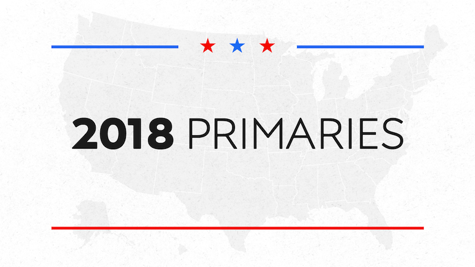

# The Democratic Primaries 2018
### _Shannon Gatta, Andrea Jorge, Charlene  Chen, Julia Zaratan_

## A Political Shift...

As the coming of a younger generation moves into politics^[1](https://fivethirtyeight.com/features/democrats-primaries-candidates-demographics/)^, so has the shift of what you could picture an elected official for the 2018 Elections to look like. Even so, variance of gender, color, LGBTQ, among other features are still at a smaller percentage than the white male counterpart. There are reasons for this, such as the strong inclination for voters to elect someone that they share and identity with, an elected official who has held the seat for many years, etc.^[2](https://www.vox.com/polyarchy/2016/8/30/12697920/race-dividing-american-politics)^ We wanted to bring focus to the kind of candidates that are running for the Democratic Primaries across Representative, Governors, Senators, etc. while asking the question:

> "How can different factors about a democratic candidate allow us to predict whether he/she/they wins the primary?"

We are going to predict the outcome with a binary return stating whether the candidate in question will lose or advance in the primaries. After seeing the surge of candidates with uncommon factors making waves in the media on both liberal and conservative platforms, we decided to compare the numbers ourselves to detect if the new candidates are the new norm, or exceptions to the rules. We strive to connect with the politically active community to bring facts to voters, on both sides of the spectrum. Diversity for liberals and conservatives alike bring a unique perspective to their office role, and the uncommon candidate should both be informed whether or not the war has been won, and if their diversity truly brings favorable results to their campaign, or if this is just the beginning.
